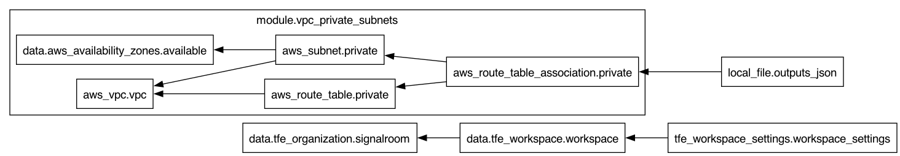

# Infrastructure as Code (IaC) AWS Private VPC Setup
This repository contains Terraform code to create a private Virtual Private Clouds (VPC) in AWS. The setup includes subnets, route tables, security groups, and other necessary components to establish a secure and isolated network environment.

Below is the Terraform visualization of the infrastructure that's created:



**Table of Contents**

<!-- toc -->
+ [**1.0 Getting Started**](#10-getting-started)
+ [**2.0 Resources**](#20-resources)
<!-- tocstop -->

---

## **1.0 Getting Started**
1. Install the following on your local machine:
    - [AWS CLI version 2](https://docs.aws.amazon.com/cli/latest/userguide/getting-started-install.html)
    - [Terraform CLI version 1.14.3 or higher](https://developer.hashicorp.com/terraform/install)

2. Clone the repo:
    ```bash
    git clone https://github.com/j3-signalroom/iac-aws-private-vpc.git
    ```

3. Update the cloned Terraform module's [main.tf](main.tf) by following these steps:

    a. Locate the `terraform.cloud` block and replace **`signalroom`** with your [Terraform Cloud Organization Name](https://developer.hashicorp.com/terraform/cloud-docs/users-teams-organizations/organizations).

    b. In the `terraform.cloud.workspaces` block, replace **`iac-aws-private-vpc`** with your [Terraform Cloud Organization's Workspaces Name](https://developer.hashicorp.com/terraform/cloud-docs/workspaces).

4. To run repo's [Terraform configuration](main.tf) locally, follow these steps:

    a. Navigate to the root folder of the `iac-aws-private-vpc/` repository that you cloned.

    b. Open a terminal in that directory.

    c. Execute the following [bash script](./deploy.sh) to deploy the project’s Terraform configuration locally. This command sets up one or more AWS VPCs, including subnets, route tables, security groups, and other necessary components, to establish a secure and isolated network environment:

    > **Note**: _The script and this project, in general, assume your hyperscaler is **AWS**. Additionally, it is expected that the AWS account is configured with SSO (Single Sign-On) support._

    ```bash
    ./deploy.sh create --profile=<SSO_PROFILE_NAME> \
                       --tfe-token=<TFE_TOKEN> \
                       --vpc-prefix-name=<VPC_PREFIX_NAME> \
                       --vpc-cidrs=<VPC_CIDRS> \
                       [--subnet-prefix=<SUBNET_PREFIX>] \
                       [--subnet-count=<SUBNET_COUNT>] \
                       [--environment-name=<ENVIRONMENT_NAME>]
    ```

    **`deploy.sh` Arguments:**
    - `--profile` requires you to specify the AWS SSO profile name of where your AWS infrastructue will be hosted at.
    - `--tfe-token` requires you to specify the Terraform Cloud API Token used to authenicate to your hosted Terraform environment in the Cloud.
    - `--vpc-prefix-name` requires you to specify the initial name you will use to identify the VPCs to be created (e.g., `privatelink-sample`).
    - `--vpc-cidrs` requires you to list a comma-delimited CIDRs for each of the VPCs that will be created (e.g., `10.0.0.0/20,10.1.0.0/20`).
    - `--subnet-prefix` optional (default is `24`) the target prefix length for each of the VPC's subnets you want to use after subdividing your VPC CIDR block.

        For example:
        | **VPC Prefix** | `subnet_prefix` | **newbits** | Resulting Subnets | IPs per Subnet |
        |------------|----------------|---------|-------------------|----------------|
        | `/16` | `/20` | `4` | 16 subnets | 4,096 |
        | `/16` | `/24` | `8` | 256 subnets | 256 |
        | `/16` | `/28` | `12` | 4,096 subnets | 16 |
        | `/20` | `/24` | `4` | 16 subnets | 256 |
        | `/20` | `/28` | `8` | 256 subnets | 16 |
        | `/24` | `/28` | `4` | 16 subnets | 16 |

        Note:
        + The **newbits** determines how many additional bits to add to the network prefix for subnettings.
        + The **VPC Prefix** is the number after the slash in your VPC's CIDR block.  It indicates **how many bits define the network portion** of the IP address range.

    - `--subnet-count` optional (default is `3`) the number of subnets created for each of the VPCs created.
    - `--environment-name` optional (default is `dev`) the name of the environment that will be appended to the name of the VPC.

## **2.0 Resources**
- [CIDR to IPv4 Conversion](https://www.ipaddressguide.com/cidr)